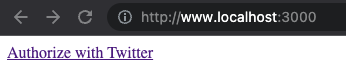
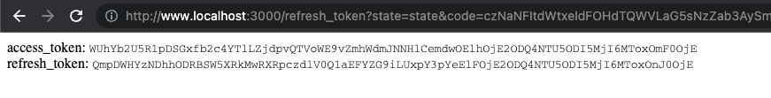
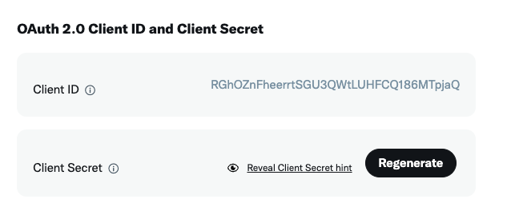
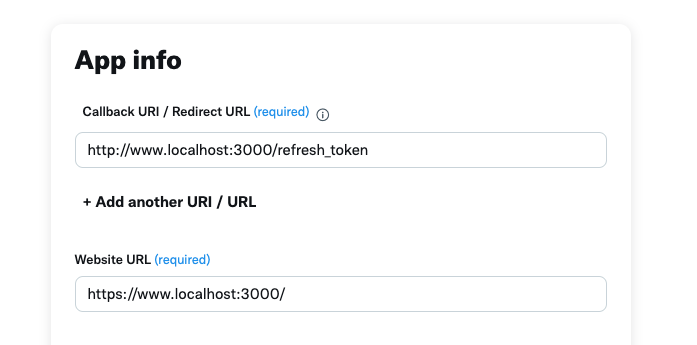

# twitter-refresh-token

You just wanted to create a twitter bot and you have realized that you need to create a whole web application that handle account authentication in order to create some tweets for it? See [Making requests on behalf of users](https://developer.twitter.com/en/docs/authentication/oauth-2-0/user-access-token) in twitter documentation.

So this repo is the tool you need, run it locally get the authorization and refresh token for your bot and use it in your application.

## How does it work?
This repo contains a simple web application that display a link to authenticate your user bot.



Clicking that link will redirect you to twitter authentication page, where you can authorize use your bot account to authorize your application


After authenticating you will see the access and refresh tokens for manage your bot account using the twitter API in your server.




## Configuration
1. You need to create an application in the twitter developer console, and generate some `Oauth 2.0` credentials
  
. Save those credentials, you will need them later.

2. Also in the user authentication settings, need to setup the Oauth redirect URL to

```
http://www.localhost:3000/refresh_token
```
Notice that we use `www` before `localhost` because twitter will not allow you to use `localhost` as a valid domain.



3. Once you have them. Clone this repo and install the dependencies:
```bash
git clone git@github.com:arqex/twitter-refresh-token.git
cd twitter-refresh-token
npm install
```
4. Rename the `env.example` file to `.env` and fill the credentials with the ones you have generated in the twitter developer console. (Step 1)
5. Run the application
```bash
npm start
```
6. Open your browser in `http://www.localhost:3000` and click the link to authenticate your bot account.
7. If this repo has been useful for you, please star it. Thanks!

## License
MIT


